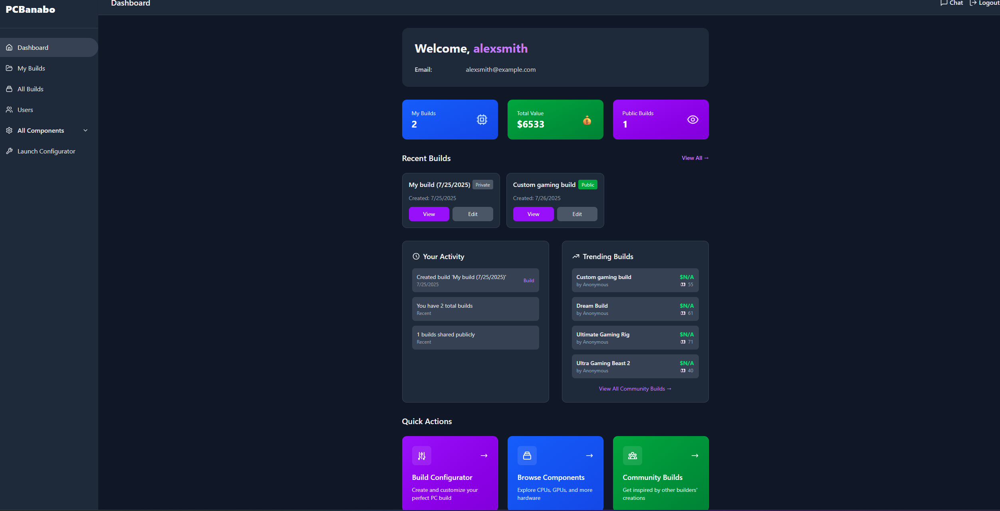
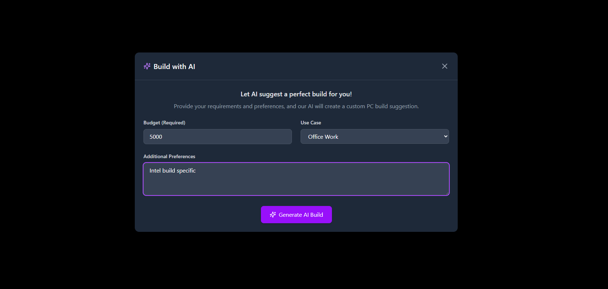
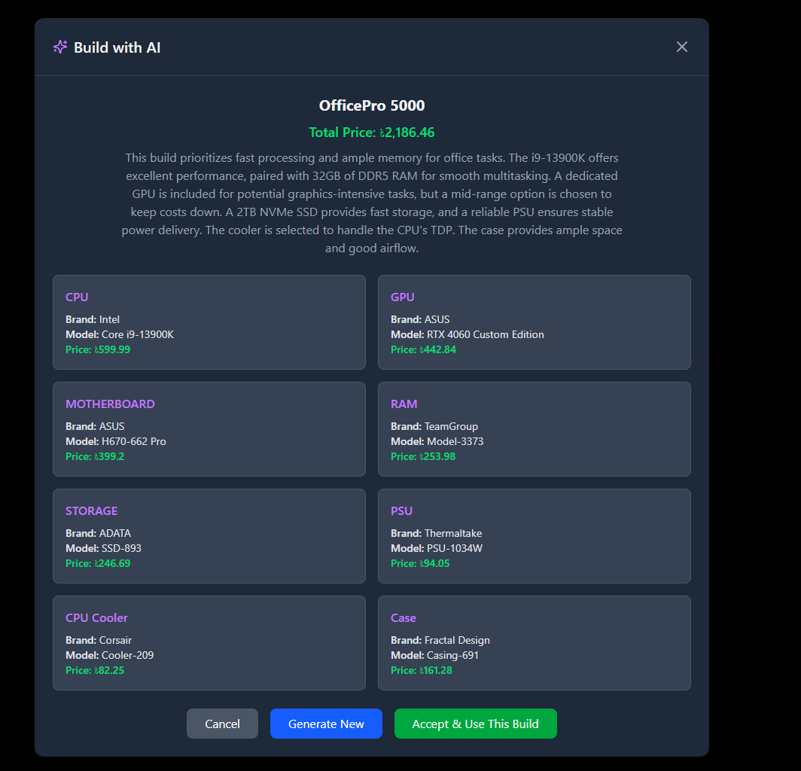
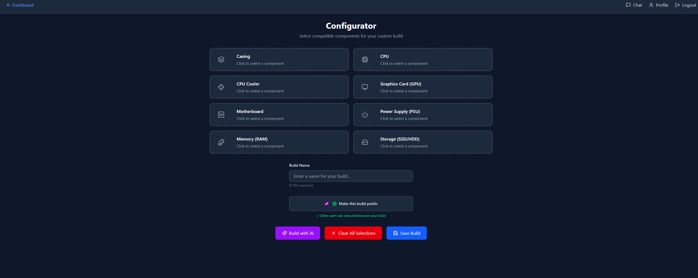
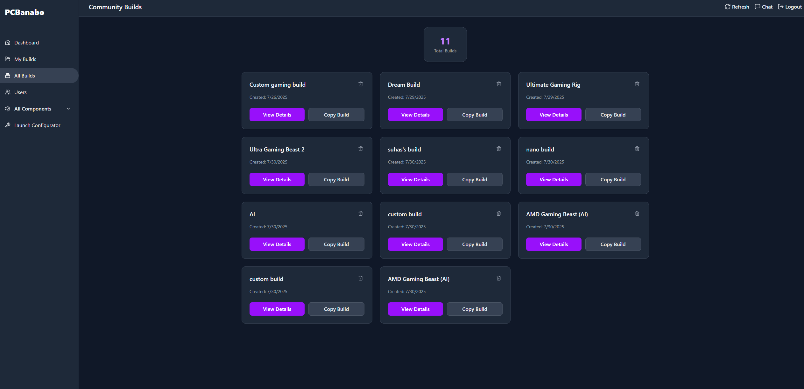
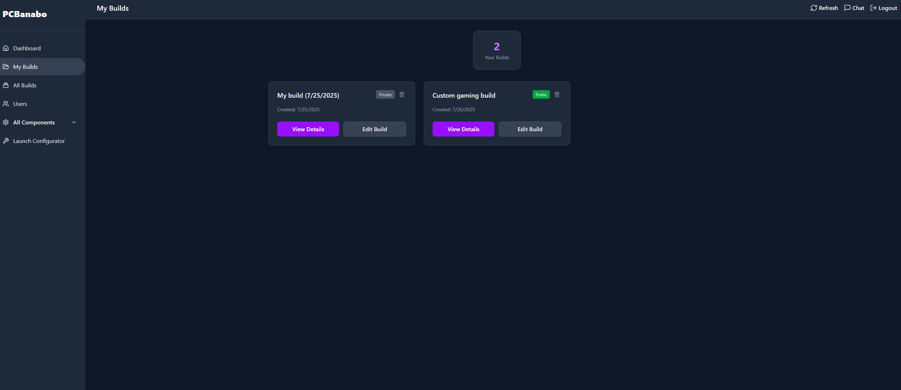
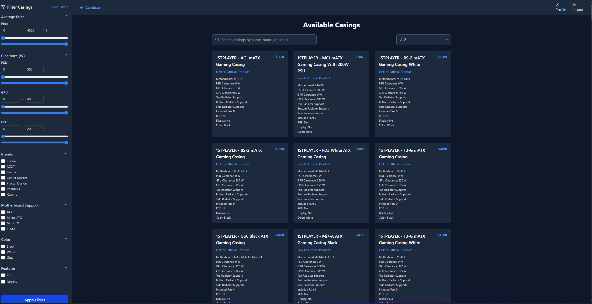
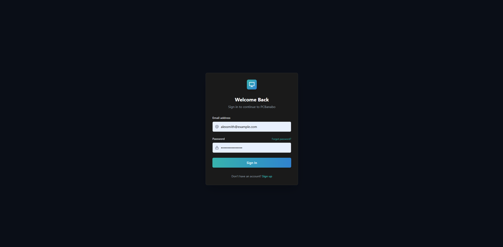

# PCBanabo 🖥️

A comprehensive PC building configurator and community platform that helps users build their dream PC with AI assistance, benchmark analysis, community sharing, and automated component data scraping.



## ✨ Features

### 🤖 AI-Powered Build Generation
Get personalized PC build recommendations based on your budget, use case, and preferences.




### 🛠️ Interactive Configurator
Build your PC step-by-step with real-time compatibility checking and price tracking.



### 📊 Benchmark Analysis
View detailed performance benchmarks for gaming, creative work, and productivity tasks with intelligent benchmark combination for CPU+GPU configurations.

### 🕷️ Automated Component Scraping
Real-time component data collection from major PC hardware retailers:

- **Source**: StarTech Bangladesh ([startech.com.bd](https://www.startech.com.bd))
- **Components Scraped**:
  - **CPUs**: Model names, prices, specifications, socket types, cache sizes, TDP ratings
  - **GPUs**: Graphics cards, VRAM, dimensions, power requirements, TDP, RGB features
  - **Cases**: Motherboard support, clearances, fan configurations, RGB/display features
- **Scraping Tools**: Selenium WebDriver with automated pagination and error handling
- **Update Frequency**: Configurable interval (default: 10 hours)

### 🌐 Community Features
- Share your builds publicly
- Browse community builds for inspiration
- User profiles and build showcases




### 🔍 Component Browser
Explore extensive database of PC components with detailed specifications and real-time pricing.



## 🚀 Getting Started

### Prerequisites
- Java 17+
- Node.js 18+
- PostgreSQL 13+
- Docker (optional)
- Chrome/Chromium browser (for scraping)

### Installation

#### Using Docker (Recommended)
```bash
# Clone the repository
git clone https://github.com/yourusername/pcbanabo.git
cd pcbanabo

# Start the application
docker-compose up -d
```

The application will be available at:
- Frontend: http://localhost:3000
- Backend API: http://localhost:8080

#### Manual Setup

##### Database Setup (PostgreSQL)

**Option 1: Install PostgreSQL locally**

1. **Install PostgreSQL**:
   ```bash
   # Windows (using chocolatey)
   choco install postgresql
   
   # Or download from https://www.postgresql.org/download/windows/
   ```

2. **Create Database and User**:
   ```sql
   -- Connect to PostgreSQL as superuser
   psql -U postgres
   
   -- Create database
   CREATE DATABASE pcbanabo;
   
   -- Create user (optional, you can use postgres user)
   CREATE USER pcbanabo_user WITH PASSWORD 'your_secure_password';
   
   -- Grant privileges
   GRANT ALL PRIVILEGES ON DATABASE pcbanabo TO pcbanabo_user;
   
   -- Exit psql
   \q
   ```

3. **Configure Database Connection**:
   Create `application.properties` in `src/main/resources/`:
   ```properties
   # Database Configuration
   spring.datasource.url=jdbc:postgresql://localhost:5432/pcbanabo
   spring.datasource.username=pcbanabo_user
   spring.datasource.password=your_secure_password
   spring.datasource.driver-class-name=org.postgresql.Driver
   
   # JPA/Hibernate Configuration
   spring.jpa.hibernate.ddl-auto=update
   spring.jpa.show-sql=true
   spring.jpa.properties.hibernate.dialect=org.hibernate.dialect.PostgreSQLDialect
   spring.jpa.properties.hibernate.format_sql=true
   
   # Server configuration
   server.port=8080
   
   # JWT settings
   jwt.secret=your_jwt_secret_here
   jwt.expiration-ms=3600000
   
   # Gemini AI Configuration  
   gemini.api-key=your_gemini_api_key
   gemini.model=models/gemini-2.0-flash
   
   # Scraping settings
   scrape.interval.ms=36000000
   ```

**Option 2: Using Docker for Database Only**

```bash
# Run PostgreSQL in Docker
docker run --name pcbanabo-postgres \
  -e POSTGRES_DB=pcbanabo \
  -e POSTGRES_USER=pcbanabo_user \
  -e POSTGRES_PASSWORD=your_secure_password \
  -p 5432:5432 \
  -d postgres:15

# Verify connection
docker exec -it pcbanabo-postgres psql -U pcbanabo_user -d pcbanabo
```

##### Backend Setup

```bash
# Navigate to project root
cd pcbanabo

# Ensure PostgreSQL is running and database is created
# (See Database Setup section above)

# Build with Maven (this will also run tests)
./mvnw clean install

# Run database migrations (handled automatically by Spring Boot)
# The application will create tables on first run due to spring.jpa.hibernate.ddl-auto=update

# Run the Spring Boot application
./mvnw spring-boot:run
```

The backend will start on `http://localhost:8080`

**Verify Backend is Running**:
```bash
# Check if chat API is responding
curl http://localhost:8080/api/chat

# Check components endpoints
curl http://localhost:8080/api/components/cpus
```

##### Frontend Setup

```bash
# Navigate to frontend directory
cd frontend

# Install dependencies
npm install

# Start development server
npm run dev
```

The frontend will start on `http://localhost:3000`

##### Database Initialization (Optional)

If you want to populate the database with sample data:

```bash
# Option 1: Using SQL scripts (if available in db-init/)
psql -U pcbanabo_user -d pcbanabo -f db-init/init.sql

# Option 2: Automatic scraping to populate component data
# Note: Scrapers run automatically but can be triggered programmatically
# No manual admin endpoints currently available

# Option 3: The database will auto-create tables on first run
# Components can be populated through web scraping services
```


## 🏗️ Architecture

### Backend (Spring Boot)
- **Framework**: Spring Boot 3.x
- **Database**: PostgreSQL with JPA/Hibernate
- **Security**: JWT Authentication
- **API**: RESTful endpoints
- **Build Tool**: Maven
- **Web Scraping**: Selenium WebDriver

### Frontend (React + Vite)
- **Framework**: React 18
- **Build Tool**: Vite
- **Styling**: Tailwind CSS
- **State Management**: React Hooks
- **Testing**: Playwright

### Key Components

#### Benchmark System
- [`BenchmarkService`](src/main/java/com/software_project/pcbanabo/service/BenchmarkService.java): Intelligent benchmark analysis
  - CPU-only benchmarks (Cinebench, Geekbench)
  - GPU-only benchmarks (Blender rendering)
  - Combined CPU+GPU benchmarks with bottleneck detection
  - Gaming performance metrics (Valorant, CS:GO, F1 2024, etc.)
  - Creative application performance (Photoshop, Premiere Pro, DaVinci Resolve)

#### Web Scraping Services
- [`CpuScraper`](src/main/java/com/software_project/pcbanabo/service/CpuScraper.java): Automated CPU data collection
  - Extracts processor specifications, pricing, and availability
  - Handles socket types, cache sizes, and TDP ratings
  - Uses regex patterns for parsing technical specifications

- [`GpuScraper`](src/main/java/com/software_project/pcbanabo/service/GpuScraper.java): Graphics card data scraping
  - Collects GPU specifications, VRAM, and performance data
  - Extracts physical dimensions and power requirements
  - Identifies RGB lighting and cooling features

- [`CasingScraper`](src/main/java/com/software_project/pcbanabo/service/CasingScraper.java): PC case specification scraping
  - Motherboard compatibility and form factor support
  - Component clearances (CPU cooler, GPU, PSU)
  - Pre-installed fan configurations and RGB features
  - Radiator mounting support specifications

#### Scraping Infrastructure
- **Web Driver Management**: Automated browser control with Chrome/Chromium
- **Error Handling**: Robust exception handling with retry mechanisms
- **Data Validation**: Specification parsing with regex pattern matching
- **Update Strategy**: Differential updates to avoid duplicate entries
- **Pagination Support**: Automatic page traversal for complete data collection
- **Scheduled Execution**: Configurable interval-based scraping (currently disabled in @Scheduled annotations)

## 📱 Screenshots

### Authentication


### User Management
Browse and connect with other PC builders in the community.

## 🔧 Configuration

### Environment Variables
```env
# Database
SPRING_DATASOURCE_URL=jdbc:postgresql://localhost:5432/pcbanabo
SPRING_DATASOURCE_USERNAME=your_username
SPRING_DATASOURCE_PASSWORD=your_password

# JWT
JWT_SECRET=your_jwt_secret
JWT_EXPIRATION=86400000

# AI Service - Gemini API
GEMINI_API_KEY=your_gemini_api_key
GEMINI_MODEL=models/gemini-2.0-flash

# Scraping Configuration  
SCRAPE_INTERVAL_MS=36000000
```

### Frontend Configuration
Create `.env.local` in the `frontend/` directory based on `.env.example`:
```env
# API Base URL
VITE_API_BASE_URL=http://localhost:8080/api

# Environment
VITE_NODE_ENV=development

# App Configuration
VITE_APP_NAME=PCBanabo
VITE_DEFAULT_THEME=light
VITE_ENABLE_DARK_MODE=true
```

### Scraping Configuration
The scraping system can be configured through application properties:

```properties
# Scraping intervals (milliseconds)
scrape.interval.ms=36000000

# WebDriver settings (configured in Java)
# Chrome driver is managed by Spring Boot application
```

## 📖 API Documentation

Detailed API documentation is available in [`pcbanabo_api_documentation.md`](pcbanabo_api_documentation.md).

### Key Endpoints
- `POST /auth/register` - User registration
- `POST /auth/login` - User authentication  
- `GET /api/shared-builds` - Retrieve public builds
- `POST /api/shared-builds/{userId}` - Create new build
- `GET /api/shared-builds/{userId}` - Get user's builds
- `GET /api/components/{type}` - Get components by type (cpus, gpus, casings, etc.)
- `GET /api/benchmarks/{buildId}` - Get performance benchmarks for a build
- `POST /api/chat` - AI chat assistant
- `POST /api/chat/suggest-build` - AI build suggestions
- `GET /api/users` - Get all users
- `GET /api/users/{id}` - Get user by ID

### Benchmark API Features
- **Smart Benchmark Combination**: Automatically combines CPU and GPU benchmarks when exact matches aren't available
- **Bottleneck Detection**: Uses minimum performance values for applications that depend on both CPU and GPU
- **Fallback Strategy**: Gracefully handles missing benchmark data with intelligent defaults

## 🕷️ Web Scraping Details

### Supported Websites
- **StarTech Bangladesh**: Primary source for component data and pricing

### Scraped Data Points

#### CPU Information
- Model names and SKU numbers
- Brand information (Intel, AMD)
- Socket compatibility
- Cache sizes (L1, L2, L3)
- TDP (Thermal Design Power)
- Current pricing and availability

#### GPU Information
- Graphics chip specifications
- VRAM capacity and type
- Physical dimensions (length, width, height)
- Power connector requirements
- TDP ratings
- RGB lighting capabilities

#### PC Case Information
- Motherboard form factor support
- Component clearances:
  - Maximum CPU cooler height
  - Maximum GPU length
  - PSU clearance specifications
- Pre-installed fan configurations
- Radiator mounting support (top, side, bottom)
- RGB and LCD display features

### Scraping Technology Stack
- **Selenium WebDriver**: Browser automation and page interaction
- **Chrome/Chromium**: Headless browser for web scraping
- **Regex Parsing**: Pattern matching for specification extraction
- **Spring Scheduling**: Automated periodic updates
- **Error Recovery**: Robust handling of network issues and page changes

### Data Processing Pipeline
1. **Page Discovery**: Automatic pagination handling
2. **Content Extraction**: CSS selector-based data extraction
3. **Specification Parsing**: Regex-based specification processing
4. **Data Validation**: Type checking and format validation
5. **Database Integration**: Upsert operations to prevent duplicates
6. **Price Tracking**: Historical pricing data collection

## 🧪 Testing

### Backend Tests
```bash
./mvnw test
```

### Frontend Tests  
```bash
cd frontend
npm run test
```

### End-to-End Tests
```bash
cd frontend
npm run test:e2e
```

Note: Scraper testing classes exist but may need individual testing setup with WebDriver configuration.

## 🚀 Deployment

### Production Build
```bash
# Backend
./mvnw clean package -Pprod

# Frontend
cd frontend
npm run build
```

### Docker Production
```bash
docker-compose -f docker-compose.prod.yml up -d
```

### Scraping in Production
For production deployment, ensure:
- Chrome/Chromium is installed in the container
- Sufficient memory allocation for browser instances
- Network access to target websites
- Appropriate rate limiting to respect website policies
- Consider enabling @Scheduled annotations for automatic scraping

## 🤝 Contributing

1. Fork the repository
2. Create a feature branch (`git checkout -b feature/amazing-feature`)
3. Commit your changes (`git commit -m 'Add amazing feature'`)
4. Push to the branch (`git push origin feature/amazing-feature`)
5. Open a Pull Request

### Scraping Contributions
When contributing to scraping functionality:
- Respect website terms of service and robots.txt
- Implement appropriate delays between requests
- Handle errors gracefully with proper logging
- Test scraping logic thoroughly before deployment

## 📝 License

This project is licensed under the MIT License - see the [LICENSE](LICENSE) file for details.

## 🙋‍♂️ Support

For questions and support, please open an issue on GitHub or contact the development team.

## 🔮 Roadmap

- [ ] Mobile application
- [ ] Advanced AI recommendations with better context
- [ ] Real-time price tracking with alerts  
- [ ] Component availability notifications
- [ ] Build comparison tools
- [ ] VR/AR build visualization
- [ ] Additional retailer integrations
- [ ] International pricing support
- [ ] Advanced benchmark analytics
- [ ] Component compatibility verification
- [ ] Admin dashboard for scraping management
- [ ] Direct scraping trigger endpoints

---

**Built with ❤️ by the PCBanabo Team**

*Data sourced from StarTech Bangladesh and other authorized retailers. All trademarks and product names are property of their respective owners.*